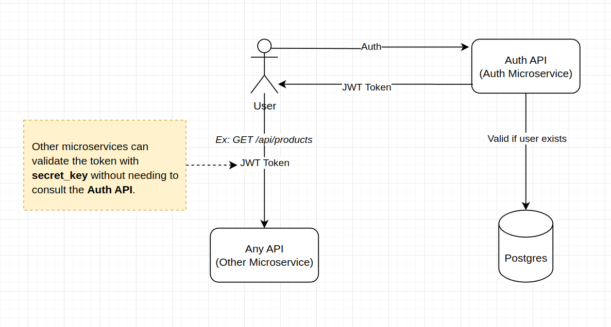

# Stateless Authentication (Java)

### Tecnology
- [Java 17](https://jdk.java.net/17/)
- [Spring Boot 3.2.4](https://spring.io/blog/2024/03/21/spring-boot-3-2-4-available-now)
- [Gradle 8.7](https://docs.gradle.org/current/release-notes.html)
- Postgres (latest)
- Swagger

### Build
1. Intall **Python 3**
2. Execute: `python3 build.py`
> Build steps:
> - Compile Java projects: generate .jar
> - Build docker images
> - Down existing containers (if exists)
> - Up containers

#### Containers
- stateless-auth-api [link](http://0.0.0.0:8080/swagger-ui/index.html)
- stateless-any-api [link](http://0.0.0.0:8081/swagger-ui/index.html)
- stateless-auth-db

## Diagram

